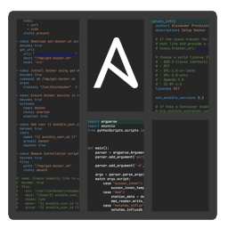

<p style="text-align:center;">
    
</p>
<h1 style="text-align:center;margin-top: -10px">Ansroled</h1>
<h3 style="text-align:center;margin-top: -10px">An editor to manage Ansible roles</h3>

## Introduction

Ansroled gives the ability to manage an Ansible role with all its various files and sub-folders in one
overview for a simplified editing experience.

<div style="text-align:center;">
  
</div>

## How to run

## Linux

Simply download the `AppImage` file and run it.

``` bash
chmod a+x Ansroled.x86_64.AppImage
./Ansroled.x86_64.AppImage
```

## Windows/macOS (untested)

I have not yet automized and tested builds for macOS and Windows, for that reason you have to compile and run it on your own.

Ensure that you have installed `.NET 9.0 SDK` on your device.

``` bash
git clone https://github.com/TheAxelander/Ansroled.git
cd Ansroled/Ansroled

dotnet run
```

To build and find an executable, run below commands:

``` bash
# For Windows
dotnet publish -r win-x64 -c Release --self-contained true -p:DebugType=None -p:DebugSymbols=false
cd bin/Release/net9.0/win-x64/publish

# For macOS
dotnet publish -r osx-arm64 -c Release --self-contained true -p:DebugType=None -p:DebugSymbols=false
cd bin/Release/net9.0/osx-arm64/publish
```
